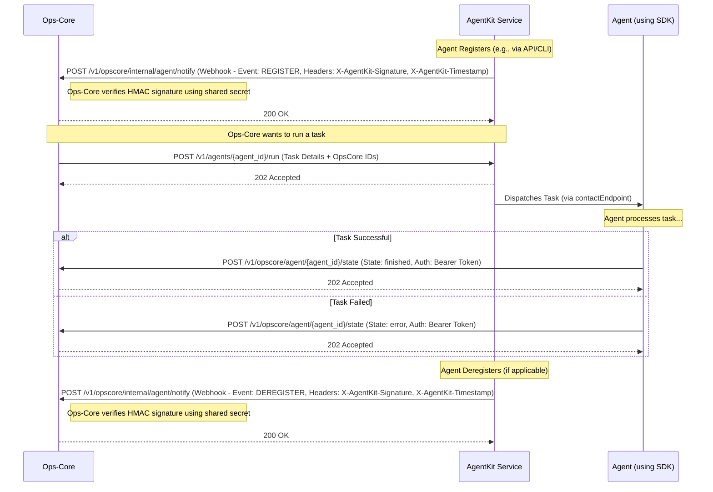

# Plan: AgentKit Enhancements for Ops-Core Integration (with HMAC)

**Date:** 2025-04-20

**Goal:** Implement webhook notifications (with HMAC authentication) for agent registration/deregistration and confirm/align the task dispatch endpoint to fully support Ops-Core integration, based on requirements in `docs/AGENTKIT_REQUIREMENTS.md`.

**Diagram of Interactions:**

**Implementation Steps:**

1.  **Implement Agent Registration/Deregistration Webhooks (Requirement 1) with HMAC:**
    *   **Location:** Modify agent registration logic (`agentkit/registration/` or `agentkit/api/endpoints/registration.py`).
    *   **Configuration:**
        *   Add `OPSCORE_WEBHOOK_URL` and `OPSCORE_WEBHOOK_SECRET` to `.env.example` and `docs/configuration.md`. The secret will be used for HMAC computation.
        *   AgentKit service reads these values.
    *   **Logic:**
        *   After successful agent registration, if `OPSCORE_WEBHOOK_URL` and `OPSCORE_WEBHOOK_SECRET` are configured:
            *   Prepare the webhook payload: `{ "event_type": "REGISTER", "agent_details": ... }`. Ensure `agent_details` matches `AgentRegistrationDetails` structure.
            *   Generate a current timestamp (e.g., Unix epoch seconds).
            *   Create the message string to sign (e.g., `f"{timestamp}.{json.dumps(payload, separators=(',', ':'))}"`).
            *   Compute the HMAC-SHA256 signature of the message string using `OPSCORE_WEBHOOK_SECRET` as the key.
            *   Make an asynchronous HTTP POST request (using `httpx`) to `OPSCORE_WEBHOOK_URL`.
            *   Include the payload as the request body.
            *   Include the timestamp in a header (e.g., `X-AgentKit-Timestamp: {timestamp}`).
            *   Include the computed signature (hex-encoded) in a header (e.g., `X-AgentKit-Signature: {signature}`).
        *   Implement similar logic for deregistration if/when that feature exists.
    *   **Error Handling:** Log errors if the webhook POST fails, but do not fail the agent registration itself.

2.  **Verify Task Dispatch Endpoint (Requirement 2):**
    *   **Location:** Review `agentkit/api/endpoints/messaging.py` (`POST /v1/agents/{agent_id}/run`).
    *   **Verification:**
        *   Confirm endpoint accepts JSON payload.
        *   Ensure Pydantic models handle `task_name`, `parameters`, `opscore_session_id`, `opscore_task_id`.
        *   Confirm `202 Accepted` response is returned immediately.
    *   **Action:** Adjust Pydantic models/logic if needed.

3.  **Verify Agent State Update Callback (Requirement 3):**
    *   **Location:** Review `agentkit/sdk/client.py`.
    *   **Verification:**
        *   Confirm `report_state_to_opscore` sends the correct `AgentStateUpdatePayload`.
        *   Confirm async `httpx` usage.
        *   Confirm correct reading/sending of `OPSCORE_API_URL` and `OPSCORE_API_KEY` (Bearer token).
    *   **Action:** Final review against specs. Update SDK Pydantic models if needed. Ensure `examples/opscore_aware_agent.py` is accurate.

4.  **Testing:**
    *   **Unit Tests:**
        *   Add tests for HMAC signature generation logic.
        *   Add/update tests for webhook sending logic (mocking `httpx`).
        *   Update tests for `/run` endpoint payload validation.
        *   Review SDK tests for `report_state_to_opscore`.
    *   **Integration Tests:**
        *   Enhance `tests/integration/test_opscore_integration.py`:
            *   Mock Ops-Core `POST /v1/opscore/internal/agent/notify`. The mock *must* verify the `X-AgentKit-Timestamp` and `X-AgentKit-Signature` headers by recomputing the HMAC signature using the shared secret.
            *   Test that AgentKit sends the correct REGISTER webhook payload and valid HMAC signature upon agent registration.
            *   Use existing mock for `POST /v1/opscore/agent/{agent_id}/state` to verify SDK callback.
            *   Add test simulating Ops-Core calling `/run` and verifying `202 Accepted` and subsequent state update callback.

5.  **Documentation:**
    *   Update `docs/configuration.md` with `OPSCORE_WEBHOOK_URL`, `OPSCORE_WEBHOOK_SECRET`.
    *   Update `docs/opscore_integration.md` and `docs/agentkit_integration_for_opscore.md` to detail the HMAC webhook mechanism (headers, signature computation).
    *   Ensure `README.md` and `TUTORIAL.md` reflect the complete integration flow.

6.  **Update Project Tracking:**
    *   Add a new task to `TASK.md`.
    *   Update `memory-bank/progress.md` upon completion.